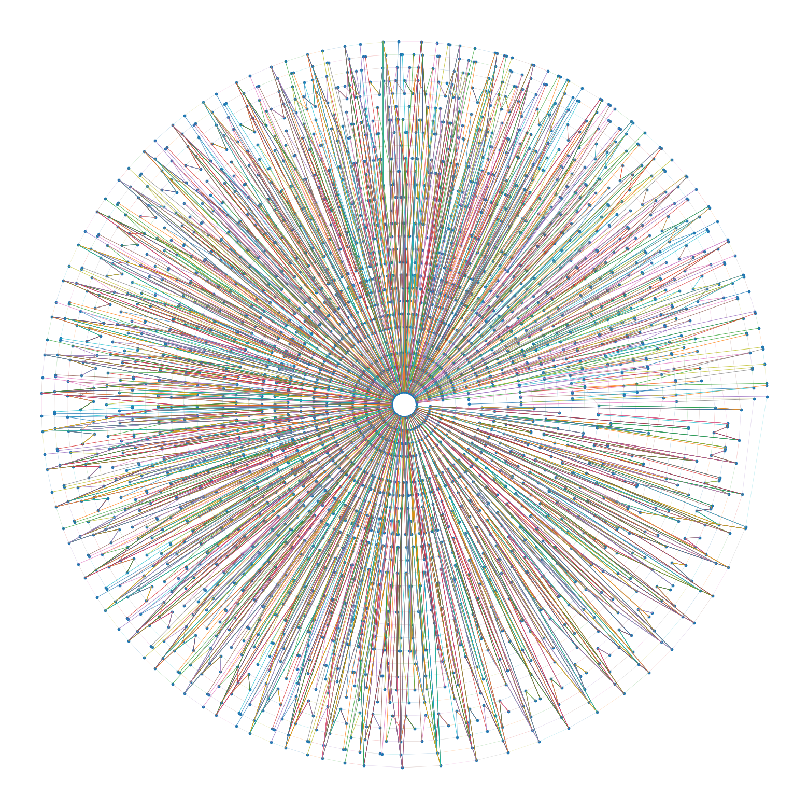

# Finding Max-Flow / Min-Cut of BART

**Yu Huang, Christian Turner, Isaiah Williams**

---

## Problem Summary

Urban rail systems in the United States, such as the San Francisco Bay Area Rapid Transit District (BART), face legitimate questions about their operational efficiency. Transit systems exist in many metropolitan areas, but it remains unclear whether the network is being used to its full potential. Efficiency can be defined through metrics such as punctuality, train frequency, and the alignment of train capacity with real-time passenger demand at each station. Given the significant investment in infrastructure and the social value of reliable public transit, it is important to model and evaluate how well BART performs relative to these criteria.
To address the question of efficiency, we propose modeling BART’s daily operations using public scheduling data[^1] and ridership snapshots[^2], drawing upon the methodology outlined in *Flows in Railway Optimization*[^3], which presents the Dutch model of railway timetabling, circulation, and capacity optimization. Using actual schedule data and daily ridership counts as inputs, we simulate flows of trains and passengers to identify bottlenecks and quantify how closely system capacity and service frequency align with passenger demand.
Our goal is to determine whether BART’s operational efficiency can be improved by testing alternative scheduling strategies, train unit allocations, and resource deployment policies.

---

## Goal

The goal of this project is to develop a **max-flow / min-cut** model, following the Dutch framework, to capture the operational dynamics of BART and provide quantitative insight into its performance. By leveraging real scheduling and ridership data, we aim to determine how effectively trains meet passenger demand throughout the day.
The Dutch model allows us to evaluate how efficiently BART utilizes its capacity, whether passenger wait times are excessive, and how well scheduling aligns with observed demand. Ultimately, this analysis seeks to determine whether Bay Area residents experience unnecessary delays or overcrowding and to identify opportunities for operational improvement. Ideally, the resulting model would be robust enough to present to BART itself, either as a proof of concept for potential employment or as a proposal for network improvements.

---

## Relevant Subject Matter

The Dutch model is grounded in the principle of **max-flow / min-cut**, a core concept in network flow theory covered in this course. Max-flow / min-cut characterizes the most efficient way to move flow through a network while identifying capacity bottlenecks.

In the context of the BART system, this framework is applied to a real-world directed graph, where nodes represent operational states or locations and edges encode capacity and scheduling constraints. Maximizing flow corresponds to maximizing the number of passengers transported subject to infrastructure, timetabling, and train frequency constraints. Minimizing the cut identifies bottlenecks in the network that restrict throughput.

This approach provides a quantitative way to identify where BART’s network falls short and what operational adjustments may improve overall efficiency.

---

## Methodology

To construct our integer linear program, we follow a simplified version of Lex Schrijver’s formulation, with constants \( m \) and \( n \) adjusted to reflect BART’s seat capacity and the maximum number of units per train.

A key modeling choice is that optimization is performed over **overnight arcs**, which correspond directly to the number of physical train units in existence. By minimizing flow over these arcs, the model captures the real-world constraint imposed by a finite rolling stock inventory while still allowing for flexible scheduling and circulation during the day.

---

## Findings

The Schrijver model optimizes for the number of cars for the current demand. Therefore, we are proposing that BART currently should run only 251 cars to be optimal. However, as of 2025, BART runs 566 cars. In practice, BART is fairly timely which would indicate significant limitations when modeling the optimum amount of cars BART should have. Ideally, we would have trip-by-trip ridership data to more accurately capture demand. Moreover, our model optimizes all lines and prescribes a total car acount for all lines. And finally, a more rigorous model would consider optimizing BART with projected population growth rates in order to build a system that is optimial for the future.

---

## Antioch to SF Intl Airport SFO/Millbrae

---
## References

[^1]: BART GTFS Schedules  
<https://www.bart.gov/schedules/developers/gtfs>

[^2]: BART Ridership Reports  
<https://www.bart.gov/about/reports/ridership>

[^3]: L. Schrijver, *Flows in Railway Optimization*  
<https://homepages.cwi.nl/~lex/files/flows_in_ro.pdf>

